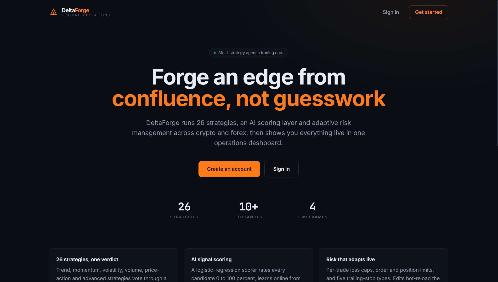

# DeltaForge


## Multi-Strategy Agentic Trading System

DeltaForge is a multi-strategy agentic trading system for crypto (direct exchange APIs via ccxt, plus a native Bitflex adapter) and forex (MT4/MT5 Expert Advisors). A Python trading core runs 26 strategies across 6 categories through a confluence-voting engine, scores each candidate with a hand-implemented logistic-regression scorer, and manages risk with hot-reloadable limits. The same core is exposed through a FastAPI service that drives a React dashboard, a terminal bot, and the MetaTrader EAs, so there is one implementation of every calculation, not a separate copy per interface.

<div align="center">
  
</div>

## Table of Contents

- [Overview](#overview)
- [Project Structure](#project-structure)
- [Feature Status](#feature-status)
- [Technology Stack](#technology-stack)
- [Architecture](#architecture)
- [Installation and Setup](#installation-and-setup)
- [Running the Stack](#running-the-stack)
- [API Surface](#api-surface)
- [Testing](#testing)
- [CI/CD Pipeline](#cicd-pipeline)
- [Documentation](#documentation)
- [Contributing](#contributing)
- [License](#license)

## Overview

DeltaForge demonstrates a trading workflow across a real, runnable codebase, and the emphasis throughout is on correct, well-tested trading logic over a large surface of unverifiable claims. Every simplifying assumption (the sandbox feed is a synthetic random walk, backtest fills use bar-close prices with no order book, the AI scorer is a from-scratch logistic regression rather than a deep model, the dashboard's auth is UI-gated rather than enforced per API route) is stated plainly rather than glossed over.

## Project Structure

```
DeltaForge/
├── code/
│   ├── backend/
│   │   ├── api/              # FastAPI server, PBKDF2-HMAC auth, live feed, app state
│   │   ├── strategies/       # 26 strategies in 6 category classes, plus the
│   │   │                     # confluence-voting engine and shared indicators
│   │   ├── risk/             # Position sizing, 5 trailing-stop types, risk manager
│   │   ├── backtest/         # Walk-forward engine and metrics
│   │   ├── exchanges/        # ccxt manager and the native Bitflex adapter
│   │   ├── trading/          # Portfolio and trade manager
│   │   ├── notifications/    # Telegram and webhook notifiers
│   │   ├── core/             # Hot-reloading config and logging
│   │   ├── tests/            # Backend unit tests
│   │   └── main.py           # Terminal bot entry point
│   └── ai_models/            # Hand-implemented logistic-regression signal scorer,
│                             # feature extraction, online learning, anomaly detection
├── frontend/
│   └── src/
│       ├── pages/            # Home, SignIn, SignUp, Dashboard, Trades, Strategies,
│       │                     # Backtest, Settings
│       ├── auth/             # Auth context and route guards
│       ├── components/       # Layout, navigation, live panels, charts
│       ├── hooks/            # Live WebSocket state with REST fallback
│       └── api/              # REST client (bearer auth, configurable base)
├── infrastructure/
│   ├── docker/               # Dockerfiles, compose, nginx
│   ├── k8s/                  # Kubernetes manifests
│   ├── terraform/            # IaC (ECR, VPC, EKS)
│   └── mql4/ mql5/           # MetaTrader Expert Advisors (source, reviewed
│                             # statically here, not compiled in CI)
├── scripts/                  # Run, backtest, dev, build, test, and setup helpers
├── docs/                     # Architecture notes
└── README.md
```

## Feature Status

### Application tier (wired and tested)

| Component                           | Details                                                                                                                                                                                                                                                                                 |
| :---------------------------------- | :-------------------------------------------------------------------------------------------------------------------------------------------------------------------------------------------------------------------------------------------------------------------------------------- |
| **Market data**                     | OHLCV via ccxt or the native Bitflex adapter; a sandbox feed drives the dashboard with a synthetic random-walk series when no exchange is connected.                                                                                                                                    |
| **Strategies**                      | 26 strategy methods across 6 category classes (advanced, momentum, price action, trend, volatility, volume), voting into a single direction and confluence score, with higher-timeframe trend confirmation before entry.                                                                |
| **AI scoring**                      | A from-scratch logistic-regression scorer (NumPy, no scikit-learn) rating each signal 0 to 100 percent, learning online from outcomes, and auto-stopping on anomalies. Its weights are handcrafted defaults, overwritten by training on real trade history via `scripts/retrain_ml.sh`. |
| **Risk**                            | Per-trade loss caps, order and position limits, and five trailing-stop types (ATR, percentage, dollar, time, volatility), all hot-reloaded from `config.json`.                                                                                                                          |
| **Execution**                       | Portfolio and trade manager tracking positions, average cost, and realized and unrealized PnL.                                                                                                                                                                                          |
| **Backtesting**                     | A walk-forward engine reporting win rate, net PnL, max drawdown, Sharpe ratio, and profit factor.                                                                                                                                                                                       |
| **Auth**                            | Token-based auth using only the Python standard library: PBKDF2-HMAC-SHA256 password hashing with a per-user salt, and HMAC-signed tokens, with no external auth dependency.                                                                                                            |
| **Web dashboard**                   | React (Vite) app with Tailwind CSS and Recharts, covering Home, Sign In, Sign Up, Dashboard, Trades, Strategies, Backtest, and Settings, talking to the API over REST and a live WebSocket stream.                                                                                      |
| **Terminal bot and MetaTrader EAs** | The same trading core drives a terminal bot and forex Expert Advisors (MQL4/MQL5), so strategy logic isn't duplicated per interface for the Python-based venues.                                                                                                                        |

## Technology Stack

| Area           | Technology                                                                           |
| :------------- | :----------------------------------------------------------------------------------- |
| Trading core   | Python 3.12, FastAPI, ccxt, pandas, NumPy                                            |
| AI / scoring   | A hand-implemented logistic-regression scorer (NumPy only, no scikit-learn)          |
| Auth           | Python stdlib only: PBKDF2-HMAC-SHA256, HMAC-signed tokens                           |
| Forex          | MQL4 / MQL5 (MetaTrader Expert Advisors)                                             |
| Web frontend   | React, Vite, Tailwind CSS, Recharts                                                  |
| Infrastructure | Docker, Docker Compose, Kubernetes, Terraform (ECR, VPC, EKS)                        |
| CI/CD          | GitHub Actions                                                                       |
| Testing        | pytest (231 test functions, many parametrized, collecting to roughly 424 test cases) |

## Architecture

```
Client
  └── frontend (React, Vite, Tailwind, Recharts)   ── HTTP/WebSocket ──┐
                                                                       ▼
FastAPI service (REST + WebSocket + auth)
                                                                       ▼
DeltaForge trading core (Python, one implementation, shared by every interface)
  strategies (26 across 6 categories) · risk · backtest · execution
  exchanges (ccxt + Bitflex adapter) · AI scorer
  core: hot-reload config, logging, notifications
      ▲                                              ▲
      │ same core                                    │ shared strategy logic
  Terminal bot                                    MT4 / MT5 EAs (MQL, reviewed
                                                   statically, not compiled in CI)
```

See [docs/architecture.md](docs/architecture.md) for detail.

## Installation and Setup

Prerequisites: Python 3.10+ and Node.js 20+. Docker is optional.

```bash
git clone https://github.com/quantsingularity/DeltaForge.git
cd DeltaForge

# Backend
pip install -r code/backend/requirements.txt -r infrastructure/docker/requirements-api.txt pytest

# Frontend
cd frontend && npm install && cd ..
```

For an automated setup:

```bash
./scripts/setup.sh
```

## Running the Stack

Development, with API and UI hot reload (two processes):

```bash
PYTHONPATH=code uvicorn backend.api.server:app --reload --port 8000
cd frontend && npm run dev      # http://localhost:5173
```

Single origin, where one process serves the API and the built dashboard:

```bash
cd frontend && npm run build && cd ..
PYTHONPATH=code uvicorn backend.api.server:app --port 8000   # http://localhost:8000
```

Full stack in containers:

```bash
docker compose -f infrastructure/docker/docker-compose.yml up --build
# Dashboard: http://localhost:8080   API docs: http://localhost:8000/docs
```

| Script                                    | What it does                                      |
| :---------------------------------------- | :------------------------------------------------ |
| `scripts/setup.sh`                        | One-time dependency and config setup              |
| `scripts/dev.sh`                          | API and Vite dev server together (hot reload)     |
| `scripts/run_sandbox.sh`                  | Paper-trading bot                                 |
| `scripts/run_bot.sh`                      | Live trading bot                                  |
| `scripts/run_backtest.sh`                 | Walk-forward backtest                             |
| `scripts/run_dashboard.sh`                | Serve the dashboard API (and built UI if present) |
| `scripts/build_frontend.sh`               | Production build of the dashboard                 |
| `scripts/retrain_ml.sh`                   | Retrain the AI scorer from trade history          |
| `scripts/docker_up.sh` / `docker_down.sh` | Start or stop the full stack in Docker            |
| `scripts/lint.sh`                         | Python and frontend lint                          |

Runtime configuration (strategies, risk, trailing stops, ML thresholds, symbols) lives in `code/backend/config.json` and hot-reloads on save. Key environment variables: `DELTAFORGE_MODE` (sandbox or live), `DELTAFORGE_EXCHANGE`, `DELTAFORGE_PORT`, `DELTAFORGE_AUTH_SECRET` (generated and persisted if unset), and `DELTAFORGE_DATA_DIR`.

## API Surface

Base URL `http://localhost:8000`.

| Method    | Path                               | Notes                                        |
| :-------- | :--------------------------------- | :------------------------------------------- |
| GET       | `/api/health`                      | Liveness probe and bot running state         |
| GET       | `/api/state`                       | Full dashboard snapshot                      |
| GET       | `/api/signals`                     | Signal matrix (symbol x timeframe)           |
| GET       | `/api/trades`                      | Open and recent closed trades                |
| GET       | `/api/risk`                        | Risk dashboard                               |
| GET       | `/api/strategies`                  | Confluence heatmap across the 26 strategies  |
| GET / PUT | `/api/config`                      | Read, or patch and hot-reload, configuration |
| POST      | `/api/bot/start` / `/api/bot/stop` | Start or stop the sandbox feed               |
| POST      | `/api/backtest`                    | Run an on-demand walk-forward backtest       |
| WS        | `/ws`                              | Live snapshot stream (about 1 Hz)            |

Full docs are auto-generated at `/docs` once the API is running.

## Testing

```bash
pytest
```

`pytest.ini` configures `PYTHONPATH`, so the suite runs from the repository root. It collects roughly 424 test cases from 231 test functions (many parametrized).

| Area            | What is covered                                                                              |
| :-------------- | :------------------------------------------------------------------------------------------- |
| Config          | Load, validate, hot-reload, and typed accessors                                              |
| Strategies      | The engine, indicator helpers, and confluence aggregation                                    |
| Risk            | Position sizing, stop and target calculation, trailing-stop engine                           |
| Portfolio       | Average-cost accounting, realized and unrealized PnL                                         |
| Backtest        | Walk-forward engine and every metric (win rate, drawdown, Sharpe, profit factor)             |
| Exchanges       | Exchange manager behavior and the Bitflex adapter                                            |
| AI layer        | Feature extraction, signal scoring, online learning, anomaly detection                       |
| Auth            | Registration, duplicate and weak-password rejection, login, token round-trip, tamper, expiry |
| API regressions | The scorer feature-vector crash and the strategies serialization fix are locked in           |

The REST API and WebSocket were exercised end to end against a live server; the built frontend is served by the same FastAPI process that answers the API.

## CI/CD Pipeline

GitHub Actions (`.github/workflows/cicd.yml`) currently runs a single job on push and pull request:

| Job                 | What it does                                                                                                                                                        |
| :------------------ | :------------------------------------------------------------------------------------------------------------------------------------------------------------------ |
| Code Quality Checks | Python formatter checks (autoflake, black) and a repository-wide Prettier check (with a Solidity-aware plugin, though there are no Solidity files in this project). |

There is currently no CI job that runs the pytest suite (231 test functions locally) or builds the frontend; both happen locally via `scripts/test.sh` and `scripts/build_frontend.sh`, but not automatically in CI.

## Documentation

| Document                                             | Contents                                   |
| :--------------------------------------------------- | :----------------------------------------- |
| [docs/architecture.md](docs/architecture.md)         | System architecture notes                  |
| [code/README.md](code/README.md)                     | Backend and AI models overview             |
| [frontend/README.md](frontend/README.md)             | Frontend structure                         |
| [infrastructure/README.md](infrastructure/README.md) | Docker, Kubernetes, Terraform, and MQL EAs |
| [scripts/README.md](scripts/README.md)               | What each helper script does               |

## Contributing

Open a pull request.

## License

This project is licensed under the MIT License - see the [LICENSE](LICENSE) file for details.
